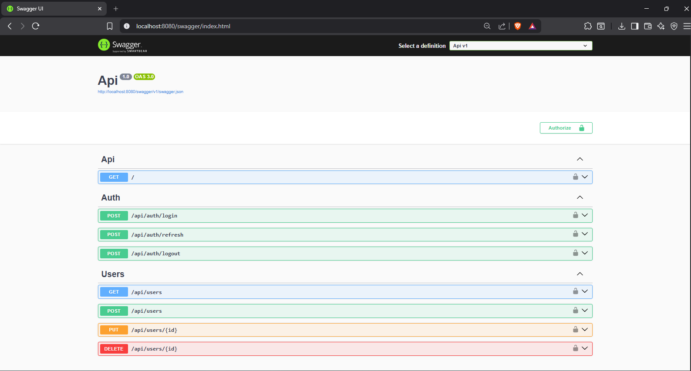
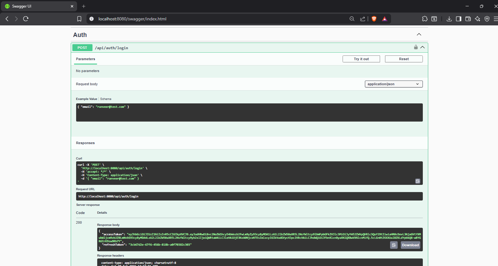
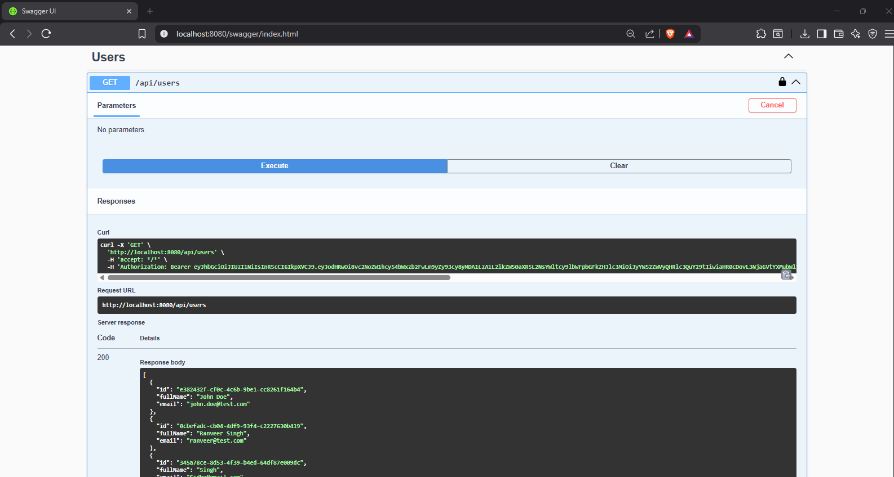

# EnterpriseApp — ASP.NET Core Web API

A production-ready REST API built with **Clean Architecture**, featuring JWT authentication with refresh tokens, role-based authorization, Entity Framework Core, SQL Server, and Docker support.

> Built with ASP.NET Core 9 · C# · SQL Server · Docker

---

## Features

- **Clean Architecture** — API / Application / Domain / Infrastructure layers
- **JWT Authentication** — short-lived access tokens (15 min) + refresh tokens (7 days)
- **Role-based Authorization** — Admin and User roles via claims
- **Entity Framework Core** — code-first migrations, repository pattern
- **Global Exception Handling** — centralized middleware
- **Swagger / OpenAPI** — interactive API documentation with Bearer auth
- **Dockerized** — multi-stage Linux container build

---

## Architecture

```
src/
├── Api/                  # Controllers, Middleware, Program.cs
├── Application/          # DTOs, Interfaces, Services (business logic)
├── Domain/               # Entities, Domain Interfaces
└── Infrastructure/       # DbContext, Migrations, Repositories, DI
```

The layers follow a strict dependency rule: outer layers depend on inner ones, never the reverse. The Domain layer has zero external dependencies.

---

## Tech Stack

| Layer | Technology |
|---|---|
| Framework | ASP.NET Core 9 |
| Language | C# |
| ORM | Entity Framework Core |
| Database | Microsoft SQL Server |
| Auth | JWT Bearer + Refresh Tokens |
| Docs | Swagger / OpenAPI |
| Container | Docker (Linux, multi-stage) |

---

## API Endpoints

### Auth
| Method | Endpoint | Description | Auth |
|---|---|---|---|
| POST | `/api/auth/login` | Login, returns JWT + refresh token | Public |
| POST | `/api/auth/refresh` | Exchange refresh token for new access token | Public |
| POST | `/api/auth/logout` | Invalidate refresh token | Public |

### Users
| Method | Endpoint | Description | Auth |
|---|---|---|---|
| GET | `/api/users` | List all users | Admin only |
| POST | `/api/users` | Create a new user | Admin only |
| PUT | `/api/users/{id}` | Update user | Admin only |
| DELETE | `/api/users/{id}` | Delete user | Admin only |

---

## Getting Started

### Prerequisites
- [.NET 9 SDK](https://dotnet.microsoft.com/download)
- SQL Server (local or Docker)
- Docker (optional)

### Run Locally

1. **Update connection string** in `src/Api/appsettings.json`

2. **Apply migrations**
   ```bash
   dotnet ef database update --project src/Infrastructure --startup-project src/Api
   ```

3. **Run the API**
   ```bash
   dotnet run --project src/Api
   ```

4. **Open Swagger**
   ```
   https://localhost:<port>/swagger
   ```

### Run with Docker

```bash
# Build
docker build -t enterprise-api .

# Run
docker run -d -p 8080:8080 \
  -e ASPNETCORE_ENVIRONMENT=Development \
  -e ConnectionStrings__DefaultConnection="Server=host.docker.internal;Database=EnterpriseAppDb;User Id=sa;Password=YourPassword;TrustServerCertificate=True" \
  enterprise-api
```

> **Note:** Docker uses SQL authentication. Windows Authentication is not supported in Linux containers.

Open Swagger at `http://localhost:8080/swagger`

---

## Screenshots

| Swagger UI | JWT Login | Authorized Request |
|---|---|---|
|  |  |  |

---

## Authentication Flow

```
Client → POST /api/auth/login → { accessToken, refreshToken }
Client → Sends accessToken in Authorization: Bearer <token> header
Token expires (15 min) → POST /api/auth/refresh → new accessToken
Logout → POST /api/auth/logout → refresh token invalidated in DB
```

---

## Author

**Ranveer Singh Sidhu** — Full-Stack .NET Developer  
[LinkedIn](https://www.linkedin.com/in/ranveersinghsidhu) · [GitHub](https://github.com/RanveerSidhu)
