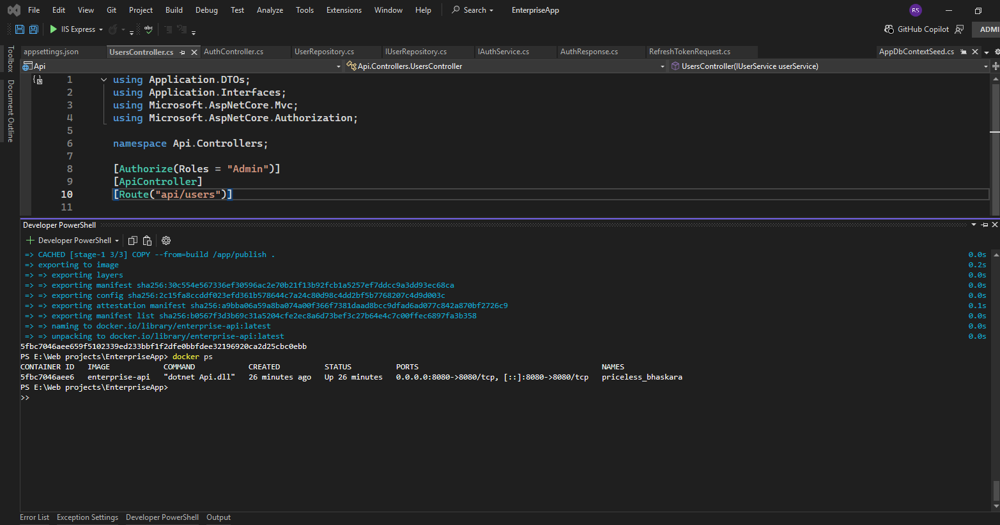

# EnterpriseApp — ASP.NET Core Web API


A production-ready REST API built with **Clean Architecture**, featuring JWT authentication with refresh tokens, role-based authorization, Entity Framework Core, SQL Server, Docker support, and a comprehensive test suite covering both unit and integration tests.

> Built with ASP.NET Core 9 · C# · SQL Server · Docker · xUnit · Moq · FluentAssertions · WebApplicationFactory

---

## Features

- **Clean Architecture** — API / Application / Domain / Infrastructure layers with strict dependency rules
- **JWT Authentication** — short-lived access tokens (15 min) + refresh tokens (7 days)
- **Role-based Authorization** — Admin and User roles enforced via JWT claims
- **Entity Framework Core** — code-first migrations, repository pattern
- **Global Exception Handling** — centralized middleware
- **Swagger / OpenAPI** — interactive API documentation with Bearer auth support
- **Dockerized** — multi-stage Linux container build
- **Unit Tests** — xUnit + Moq + FluentAssertions covering the full service layer
- **Integration Tests** — `WebApplicationFactory` + EF Core in-memory DB, testing real HTTP endpoints end-to-end
- **CI Pipeline** — GitHub Actions: build → unit tests → integration tests → Docker build on every push and PR

---

## Architecture

```
src/
├── Api/                  # Controllers, Middleware, Program.cs
├── Application/          # DTOs, Interfaces, Services (business logic)
├── Domain/               # Entities, Domain Interfaces
└── Infrastructure/       # DbContext, Migrations, Repositories, DI

tests/
├── Application.Tests/    # Unit tests   — UserService, AuthService (Moq + FluentAssertions)
└── Api.Tests/            # Integration tests — AuthController, UsersController (WebApplicationFactory)
```

The layers follow a strict dependency rule: outer layers depend on inner ones, never the reverse. The Domain layer has zero external dependencies.

---

## Tech Stack

| Layer      | Technology                                     |
|------------|------------------------------------------------|
| Framework  | ASP.NET Core 9                                 |
| Language   | C#                                             |
| ORM        | Entity Framework Core                          |
| Database   | Microsoft SQL Server (prod) / In-Memory (test) |
| Auth       | JWT Bearer + Refresh Tokens                    |
| Docs       | Swagger / OpenAPI                              |
| Container  | Docker (Linux, multi-stage)                    |
| Testing    | xUnit, Moq, FluentAssertions, WebApplicationFactory |
| CI/CD      | GitHub Actions                                 |

---

## Testing

The project has two test layers — unit tests for isolated business logic, and integration tests that boot the real ASP.NET Core pipeline.

```bash
# Run all tests
dotnet test

# Run only unit tests
dotnet test tests/Application.Tests

# Run only integration tests
dotnet test tests/Api.Tests
```

### Unit Tests — `Application.Tests`

Pure service-layer tests. Dependencies are mocked with Moq; no database or HTTP stack involved.

| Class         | Scenarios covered                                                                                          |
|---------------|------------------------------------------------------------------------------------------------------------|
| `UserService` | GetAll (empty/populated), GetById (found/not found), Create (valid + validation errors), Update (found/not found/validation), Delete (found/not found) |
| `AuthService` | Login (valid/unknown email, refresh token persisted), RefreshToken (valid/expired/invalid), Logout (valid/unknown token) |

### Integration Tests — `Api.Tests`

End-to-end HTTP tests. The real ASP.NET Core pipeline is started via `WebApplicationFactory<Program>`. SQL Server is replaced with an **EF Core in-memory database** — no external database or SQL Server installation required to run these tests.

| Controller        | Scenarios covered                                                                                    |
|-------------------|------------------------------------------------------------------------------------------------------|
| `AuthController`  | Login (seeded admin → 200 with tokens, unknown email → 500), Refresh (valid token → new access token, invalid → 500), Logout (valid → 204, unknown → 204) |
| `UsersController` | GET all (no token → 401, admin token → 200), POST (valid → 201, empty name → 500, no token → 401), PUT (valid → 200, not found → 500), DELETE (valid → 204, not found → 500) |

---

## API Endpoints

### Auth

| Method | Endpoint            | Description                           | Auth   |
|--------|---------------------|---------------------------------------|--------|
| POST   | `/api/auth/login`   | Login, returns JWT + refresh token    | Public |
| POST   | `/api/auth/refresh` | Exchange refresh token for new access | Public |
| POST   | `/api/auth/logout`  | Invalidate refresh token              | Public |

### Users

| Method | Endpoint           | Description       | Auth       |
|--------|--------------------|-------------------|------------|
| GET    | `/api/users`       | List all users    | Admin only |
| POST   | `/api/users`       | Create a new user | Admin only |
| PUT    | `/api/users/{id}`  | Update a user     | Admin only |
| DELETE | `/api/users/{id}`  | Delete a user     | Admin only |

---

## Getting Started

### Prerequisites

- [.NET 9 SDK](https://dotnet.microsoft.com/download)
- SQL Server (local or Docker)
- Docker (optional)

### Run Locally

1. **Update connection string** in `src/Api/appsettings.json`

2. **Apply migrations**
   ```bash
   dotnet ef database update --project src/Infrastructure --startup-project src/Api
   ```

3. **Run the API**
   ```bash
   dotnet run --project src/Api
   ```

4. **Open Swagger**
   ```
   http://localhost:<port>/swagger
   ```

5. **Login with seeded admin user**
   ```json
   POST /api/auth/login
   { "email": "ranveer@test.com" }
   ```

### Run Tests

```bash
dotnet test
```

Integration tests use an EF Core in-memory database — no SQL Server setup needed.

### Run with Docker

```bash
# Build
docker build -t enterprise-api .

# Run
docker run -d -p 8080:8080 \
  -e ASPNETCORE_ENVIRONMENT=Development \
  -e ConnectionStrings__DefaultConnection="Server=host.docker.internal;Database=EnterpriseAppDb;User Id=sa;Password=YourPassword;TrustServerCertificate=True" \
  enterprise-api
```

> **Note:** Docker uses SQL authentication. Windows Authentication is not supported in Linux containers.

Open Swagger at `http://localhost:8080/swagger`

---

## CI Pipeline

Every push and pull request triggers the GitHub Actions workflow:

1. **Build & Test** job:
   - Restore NuGet packages
   - Build solution in Release configuration
   - Run unit tests (`Application.Tests`) — upload results
   - Run integration tests (`Api.Tests`) — upload results

2. **Docker Build** job (runs after tests pass):
   - Build Docker image
   - Verify image builds successfully

---

## Authentication Flow

```
Client → POST /api/auth/login → { accessToken, refreshToken }
Client → Sends accessToken in Authorization: Bearer <token> header
Token expires (15 min) → POST /api/auth/refresh → new accessToken
Logout → POST /api/auth/logout → refresh token invalidated in DB
```

---

## Screenshots

| Swagger UI | JWT Login | Authorized Request | Docker Running |
|---|---|---|---|
|  |  |  |  |

---

## Author

**Ranveer Singh Sidhu** — Senior Full-Stack .NET Developer  
[LinkedIn](https://www.linkedin.com/in/ranveersinghsidhu) · [GitHub](https://github.com/RanveerSidhu)
